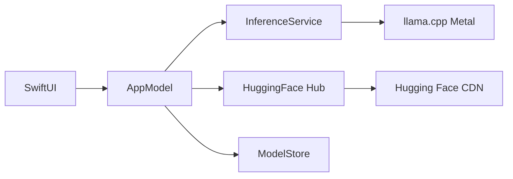

# MacLLM

<p align="center">
  <strong>Native local LLM chat for Apple Silicon Macs</strong><br>
  Metal-accelerated inference · Hugging Face downloads · LM Studio–style UI
</p>

<p align="center">
  <a href="README.md">English</a> ·
  <a href="README.tr.md">Türkçe</a>
</p>

<p align="center">
  
</p>

---

MacLLM is a **native macOS application** (Swift + SwiftUI) that runs large language models **entirely on your Mac** using [llama.cpp](https://github.com/ggml-org/llama.cpp) with **Metal GPU acceleration**. Browse and download **GGUF** models from **Hugging Face**, chat with streaming responses, and keep your data on-device.

Built for **Apple Silicon** (M1/M2/M3/M4) with **16 GB RAM** in mind — sensible defaults, curated model catalog, and an online model search.

## Features

| Feature | Description |
|--------|-------------|
| **Native UI** | SwiftUI app — sidebar models, streaming chat, settings |
| **Metal inference** | Full GPU offload via llama.cpp on Apple Silicon |
| **Online downloads** | Hugging Face catalog, search, and manual repo/file install |
| **GGUF ecosystem** | Same format as Ollama / LM Studio |
| **Privacy** | Models and chats stay in `~/Library/Application Support/MacLLM/` |
| **Import** | Drag & drop local `.gguf` files |

## Requirements

- **macOS 14+** (Sonoma or later)
- **Apple Silicon** (`arm64`) — Intel Macs are not supported
- **Xcode Command Line Tools** (for building)
- **CMake 3.28+** and **Ninja** (`brew install cmake ninja`)
- **~5–10 GB free disk** per model (depends on quantization)

### Recommended hardware (example: M3 MacBook Air 16 GB)

| Model | Size (Q4) | RAM hint |
|-------|-----------|----------|
| Llama 3.2 3B Instruct | ~2 GB | Comfortable daily driver |
| Phi-3 Mini 4K | ~2.3 GB | Fast, efficient |
| Mistral 7B Instruct | ~4.5 GB | Stronger, still fits 16 GB |
| Llama 3.1 8B Instruct | ~5 GB | Upper limit — close other apps |

## Quick start

### 1. Clone and init submodule

```bash
git clone --recurse-submodules https://github.com/kuarezma/MacLLM.git
cd MacLLM
```

If you already cloned without submodules:

```bash
git submodule update --init --recursive
```

### 2. Build llama.cpp (Metal XCFramework)

First run takes **~1–5 minutes**:

```bash
./Scripts/build-llama-xcframework.sh
```

Output: `Vendor/build-apple/llama.xcframework`

### 3. Build and run the app

```bash
./Scripts/build-app.sh
open build/MacLLM.app
```

**Or use Xcode:**

```bash
open MacLLM.xcodeproj
# Select scheme MacLLM → Run (⌘R)
```

### 4. Download a model and chat

1. Click **Online Model** (cloud icon) in the toolbar  
2. Open the **Online** tab → search or pick a recommended model → **Download**  
3. Select the model in the sidebar → type a message  

Optional: **MacLLM → Settings** for temperature, context length, GPU layers, and Hugging Face token (gated models).

## Project structure

```
MacLLM/
├── MacLLM/                 # SwiftUI app source
│   ├── App/                # App entry, AppModel
│   ├── Bridge/             # llama.cpp Swift bridge
│   ├── Features/           # Chat, models, settings UI
│   ├── Services/           # Download, inference, storage
│   └── Resources/          # Catalog JSON, assets
├── Scripts/
│   ├── build-llama-xcframework.sh
│   ├── build-app.sh        # swiftc build (no Xcode UI required)
│   └── fit-app-icon.py
├── Vendor/llama.cpp/       # git submodule
└── MacLLM.xcodeproj
```

## Data locations

| Item | Path |
|------|------|
| Models | `~/Library/Application Support/MacLLM/models/` |
| Chat history | `~/Library/Application Support/MacLLM/chats/` |
| Settings | UserDefaults + inference prefs |

Legacy **MacSistem** data is migrated automatically on first launch.

## Architecture



## Troubleshooting

| Issue | Fix |
|-------|-----|
| `llama.xcframework` missing | Run `./Scripts/build-llama-xcframework.sh` |
| Out of memory | Use a smaller Q4 model; set context to 4096 in Settings |
| Slow replies | Settings → GPU layers = **-1** (all layers on GPU) |
| Download fails | Check network/disk; add HF token for gated models |
| `no such module 'llama'` | Rebuild XCFramework; ensure `Vendor/build-apple/` exists |

## Contributing

Issues and pull requests are welcome. Please avoid committing large model files (`.gguf`) — they are downloaded at runtime.

## License

Application source is provided as-is. [llama.cpp](https://github.com/ggml-org/llama.cpp) and downloaded models are subject to their respective licenses.

---

<p align="center">
  Made for Mac · <a href="README.tr.md">Türkçe README</a>
</p>
