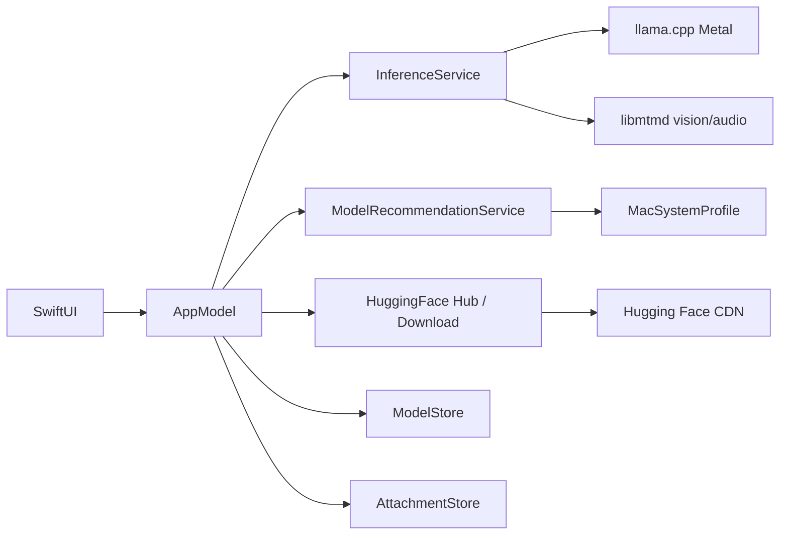

# MacLLM

<p align="center">
  <strong>Native local LLM chat for Apple Silicon Macs</strong><br>
  Metal-accelerated inference · Hugging Face downloads · LM Studio–style UI
</p>

<p align="center">
  <a href="README.md">English</a> ·
  <a href="README.tr.md">Türkçe</a>
</p>

<p align="center">
  <a href="https://github.com/kuarezma/MacLLM/releases/latest">
    
  </a>
</p>

<p align="center">
  
</p>

---

MacLLM is a **native macOS application** (Swift + SwiftUI) that runs large language models **entirely on your Mac** using [llama.cpp](https://github.com/ggml-org/llama.cpp) with **Metal GPU acceleration**. Browse and download **GGUF** models from **Hugging Face**, chat with streaming responses, and keep your data on-device.

Built for **Apple Silicon** (M1/M2/M3/M4). The app reads your **chip and physical RAM** and adapts model recommendations, default context length, and inference settings to your hardware — not a fixed “M3 16 GB” profile.

## Features

| Feature | Description |
|--------|-------------|
| **Native UI** | SwiftUI — model sidebar, streaming chat, settings, chat history |
| **Metal inference** | llama.cpp with GPU offload; RAM-tier defaults (partial layers on 8 GB Macs) |
| **Hardware-aware catalog** | Curated GGUF list sorted into *Best fit* / *Workable* / *Not recommended* for your Mac |
| **Hugging Face online** | Search models, rich repo details (tags, likes, Mac fit), download with progress |
| **Parallel downloads** | Up to **8 HTTP connections** on large GGUF files (Settings → Hugging Face); CDN direct |
| **Active download panel** | See all in-progress models, speed, ETA, pause/cancel — even with catalog closed |
| **Rich download UI** | Progress %, downloaded/total size, speed (MB/s), ETA, **pause**, **resume**, **cancel** |
| **In-app updates** | GitHub release check, download DMG/PKG/ZIP from the app |
| **GGUF validation** | Post-download integrity check; clear errors for gated/broken files |
| **Manual install** | Paste `repo-id` + `.gguf` filename, or import a local file |
| **Adaptive defaults** | First-run inference settings tuned to your RAM (8 / 16 / 24 GB+) |
| **Ollama-style settings** | Full settings window (⌘,) — sampling, context, system prompt, stop sequences |
| **Multimodal chat** | Attach **images**, **audio**, **video** (frame extract), and **documents** (PDF/text) in chat |
| **Vision models (mtmd)** | llama.cpp `libmtmd` + **mmproj** GGUF for Qwen-VL, LLaVA, Gemma 3 vision, etc. |
| **Clean replies** | Streaming filter strips ChatML/Mistral control tokens (`im_end`, `[INST]`, …) |
| **Graceful quit** | Safe shutdown: save chat, cancel downloads, unload model before exit |
| **Privacy** | Models, chats, and attachments in `~/Library/Application Support/MacLLM/` |
| **Easy distribution** | Release ships **DMG**, **PKG**, **ZIP**, and a **Homebrew cask** |

## Requirements

| | |
|--|--|
| **OS** | macOS 14+ (Sonoma or later) |
| **CPU** | Apple Silicon (`arm64`) — Intel Macs are **not** supported |
| **Disk** | ~4 MB for the app; **~1–5 GB per model** (quantization-dependent) |
| **Build only** | Xcode Command Line Tools, CMake 3.28+, Ninja (`brew install cmake ninja`) |

## Download & install

**Latest release:** [github.com/kuarezma/MacLLM/releases/latest](https://github.com/kuarezma/MacLLM/releases/latest)

Each release includes `SHA256SUMS.txt` for integrity checks.

| Package | Best for | Steps |
|---------|----------|--------|
| **`.dmg`** | Most users | Open DMG → drag **MacLLM** to **Applications** |
| **`.pkg`** | Installer wizard | Double-click → follow prompts → app lands in Applications |
| **`.zip`** | Manual copy | Unzip → move **MacLLM.app** to Applications |
| **Homebrew** | `brew` users | See below |

**First launch** (unsigned build): **right-click MacLLM → Open**, or allow in **System Settings → Privacy & Security**.

> Models are **not** bundled (~4 MB app). Download GGUF files inside the app after install.

### Homebrew

```bash
brew install --cask https://raw.githubusercontent.com/kuarezma/MacLLM/main/packaging/homebrew/macllm.rb
```

Local cask file: [packaging/homebrew/README.md](packaging/homebrew/README.md)

## Quick start

1. Install MacLLM (DMG, PKG, zip, or Homebrew).
2. Open the app → toolbar **Online Model** (cloud icon).
3. **Recommended** tab — pick a model suited to your Mac → **Download online**.
4. Wait for the download (watch speed, ETA in the **Downloads** panel; tune parallel connections in Settings).
5. Select the model in the sidebar → chat.

### Chat with attachments

Use the **paperclip** in the message bar (or drag files into the input area):

| Type | Text-only models | Vision model + mmproj |
|------|------------------|------------------------|
| **Document** (PDF, TXT, MD, RTF…) | Text extracted into the prompt | Same |
| **Image** | Warning — text-only | Sent to the vision encoder |
| **Audio** (WAV, MP3, FLAC…) | Warning | Supported on audio-capable VL models |
| **Video** | — | Up to 3 frames extracted as images |

**Vision setup:** place `*mmproj*.gguf` in the **same folder** as the main `.gguf` (auto-detected on import). Example pairs: Qwen2-VL / LLaVA / MiniCPM-V + matching mmproj.

### Model Add window

| Tab | Purpose |
|-----|---------|
| **Recommended** | Hardware-scored catalog (Llama 3.2 1B/3B, Qwen 2.5 1.5B, Phi-3 Mini, Mistral 7B, Llama 3.1 8B, …) |
| **Online** | Search Hugging Face — model cards, quant groups, Mac fit badge, repo details |
| **Manual** | Import a local `.gguf` or enter `bartowski/…` repo + filename |

### Model recommendations (adaptive)

MacLLM detects e.g. **Apple M2 · 8 GB RAM** and groups models:

- **Best fit** — expected to run comfortably  
- **Workable** — may need closing other apps  
- **Not recommended** — usually too heavy for your RAM  

| Your RAM | Sweet spot | Often too heavy |
|----------|------------|-----------------|
| 8 GB | 1B–3B | 7B–8B without closing apps |
| 16 GB | 3B–7B | 8B at the upper limit |
| 24 GB+ | 7B–8B+ | — |

Default **context length** and **max tokens** on first launch follow the same RAM tiers (e.g. 2048 on 8 GB, 4096 on 16 GB).

### Download progress

While a model downloads you see:

- Percent complete and progress bar  
- **Downloaded / total** size  
- **Speed** (MB/s or KB/s)  
- **Estimated time remaining**  
- **Pause** · **Resume** · **Cancel**

### Settings (Ollama-compatible)

Open via **MacLLM → Settings…** (⌘,), toolbar **gear** icon, or sidebar **Settings**.

| Tab | Ollama parameter | What you can set |
|-----|------------------|------------------|
| **General** | — | Version, Mac info, models/chats folder, open in Finder |
| **Model** | `num_ctx`, `num_gpu`, `num_thread` | Context 2K–32K, GPU layers (-1 = all), CPU threads |
| **Sampling** | `temperature`, `top_p`, `top_k`, `min_p`, `repeat_penalty`, `repeat_last_n`, `mirostat`, `seed` | Full sampler chain via llama.cpp |
| **Chat** | `num_predict`, `system`, `stop` | Max tokens, system prompt, stop strings (one per line) |
| **Hugging Face** | — | Access token for gated models |

**Ollama defaults** button restores typical values (temp 0.8, top_k 40, repeat_penalty 1.1, …). **Save** persists settings and reloads the model when context/GPU changes.

## Build from source

### 1. Clone and submodule

```bash
git clone --recurse-submodules https://github.com/kuarezma/MacLLM.git
cd MacLLM
```

```bash
git submodule update --init --recursive   # if already cloned
```

### 2. Build llama.cpp (Metal XCFramework)

First run ~**2–6 minutes** (includes **libmtmd** for vision/audio):

```bash
./Scripts/build-llama-xcframework.sh
```

Output: `Vendor/build-apple/llama.xcframework` (llama + ggml + Metal + **mtmd**)

### 3. Build the app

```bash
./Scripts/build-app.sh
open build/MacLLM.app
```

**Xcode:** `open MacLLM.xcodeproj` → scheme **MacLLM** → Run (⌘R)

### 4. Release packages (maintainers)

```bash
./Scripts/build-packages.sh          # zip + dmg + pkg + update Homebrew cask
./Scripts/create-release.sh 1.6.0    # build all + GitHub release (needs gh auth)
SKIP_GITHUB=1 ./Scripts/create-release.sh 1.6.0   # artifacts only, under dist/
```

Tag push (`v*`) also triggers [.github/workflows/release.yml](.github/workflows/release.yml) on GitHub Actions.

## Project structure

```
MacLLM/
├── MacLLM/
│   ├── App/                    # MacLLMApp, AppModel, AppDelegate (graceful quit)
│   ├── Bridge/                 # LibLlama, LibMtmd, mtmd_shim (llama.cpp + vision)
│   ├── Core/                   # Models, MessageAttachment, settings
│   ├── Features/
│   │   ├── Chat/               # Streaming chat, attachments UI
│   │   ├── Main/               # NavigationSplitView shell
│   │   ├── Models/             # Catalog, online search, download UI
│   │   └── Settings/           # Ollama-style settings window
│   ├── Services/
│   │   ├── HuggingFaceDownloadService.swift
│   │   ├── AttachmentStore.swift / MediaContentProcessor.swift
│   │   ├── GenerationOutputFilter.swift / ChatTemplateResolver.swift
│   │   ├── ModelRecommendationService.swift
│   │   ├── MacSystemProfile.swift
│   │   └── …
│   └── Resources/
│       └── default-catalog.json
├── packaging/homebrew/         # macllm.rb cask
├── Scripts/
│   ├── build-llama-xcframework.sh
│   ├── build-app.sh
│   ├── build-packages.sh       # dmg, pkg, zip
│   └── create-release.sh
├── Vendor/llama.cpp/           # git submodule
└── MacLLM.xcodeproj
```

## Data locations

| Item | Path |
|------|------|
| Models | `~/Library/Application Support/MacLLM/models/` |
| Chat history | `~/Library/Application Support/MacLLM/chat-sessions-index.json` |
| Message attachments | `~/Library/Application Support/MacLLM/attachments/<session-id>/` |
| Settings | UserDefaults (`inferenceSettings`, HF token) |

Legacy **MacSistem** data is migrated automatically on first launch.

## Architecture



## Changelog (recent)

| Version | Highlights |
|---------|------------|
| **1.14.0** | Jan.ai–style UI: sidebar nav, header model picker, chat bubbles, context ring (real tokens); message edit/regenerate/copy; projects (⌘P); quick prompts; code copy; Markdown export |
| **1.13.1** | Hub shows real GGUF file sizes (HF tree API); fixes “Zero KB” in quant table; reliable download totals |
| **1.13.0** | Hub file search; clickable column sort; **Kullan** for installed quants; live Hub result filter |
| **1.12.0** | Hub quant filter chips (Q2–Q8, Mac-fit), sort menu; README Markdown render with expand |
| **1.11.0** | Model Hub UI: quant table (Model / GGUF / size / download %), README + tags, download manager popover |
| **1.10.0** | Markdown headings and lists; sidebar chat search (title + messages); in-chat message search with match navigation |
| **1.9.0** | Live Markdown while streaming; async video duration API; GGUF import progress overlay; `MarkdownContentParser` unit tests |
| **1.8.0** | Per-session chat files (lighter index + auto-migration); assistant Markdown (code blocks, inline code, bold); GGUF import overwrite confirmation; `Scripts/smoke-test.sh` |
| **1.7.0** | Reliable model switching, generation lock, session safety; attachment validation; delete confirmations; clearer status and loading UI |
| **1.6.1** | KV cache reset per message; clearer inference errors; composer layout fix |
| **1.6.0** | Chat attachments (image, audio, video, documents); **libmtmd** + mmproj for vision models; reply token sanitization; graceful app quit; model eject & chat delete UI |
| **1.5.4** | `GenerationOutputFilter` — stop sequences and ChatML token leaks fixed during streaming |
| **1.5.3** | Graceful shutdown on quit (unload model, cancel downloads) |
| **1.5.2** | Model unload button, visible chat delete, wider message input |
| **1.5.1** | Unified fit badges, faster download panel cleanup, catalog UX, search debounce, generating subtitle |
| **1.5.0** | UI polish: shared theme, session delete/selection, auto-save settings, cleaner downloads panel, status auto-dismiss |
| **1.4.3** | ChatML stop tokens (`im_end`, `im_start`) to prevent control-token leaks in replies |
| **1.4.2** | Fix Mistral v0.3 chat: map GGUF Jinja to `mistral-v3` builtin (avoid Llama-2 mis-detection) |
| **1.4.1** | Mistral instruct chat template fix (`mistral-v3`), model-specific stop sequences, template repair for installed models |
| **1.4.0** | Parallel HF downloads (multi-connection), active downloads panel, rich online model catalog, GGUF validation, RAM-tier GPU defaults, streaming perf |
| **1.3.2** | In-app GitHub updates; Swift 6 CI fix for Settings |
| **1.3.0** | Settings window (⌘,) with Ollama-compatible parameters (top_k, repeat_penalty, mirostat, system, stop) |
| **1.2.2** | Documentation update; DMG, PKG, ZIP, Homebrew packages |
| **1.2.1** | PKG installer, Homebrew cask, `build-packages.sh` |
| **1.2.0** | Download speed/ETA, pause/resume/cancel, DMG installer |
| **1.1.0** | Hardware-aware model recommendations, expanded catalog (1B–8B) |
| **1.0.0** | Initial release — Metal chat, HF downloads, SwiftUI shell |

Full history: [Releases](https://github.com/kuarezma/MacLLM/releases)

## Troubleshooting

| Issue | Fix |
|-------|-----|
| App won’t open | Right-click → **Open**; check Privacy & Security |
| `llama.xcframework` missing | `./Scripts/build-llama-xcframework.sh` |
| Out of memory | Smaller model (1B/3B); lower context in Settings; close other apps |
| Slow download | Settings → Hugging Face → **Parallel connections** (try 6–8); check VPN/firewall |
| Slow replies | Lower context in Settings; on 8 GB Macs GPU layers are capped automatically |
| Download fails | Disk space; network; HF token for gated models; retry after validation error |
| Download stuck | **Cancel** and retry; check firewall/VPN |
| `no such module 'llama'` | Rebuild XCFramework; symlink `Modules` in framework if needed |
| Homebrew SHA mismatch | Cask SHA matches release DMG — use [latest release](https://github.com/kuarezma/MacLLM/releases/latest) URL |
| Image not understood | Use a **vision** GGUF + **mmproj** in the same folder; text-only models only get document text |
| `im_end` in replies | Update to **1.5.4+**; older builds lacked streaming token filters |

## Contributing

Issues and pull requests welcome. Do **not** commit `.gguf` model files — they are downloaded at runtime.

## License

Application source is provided as-is. [llama.cpp](https://github.com/ggml-org/llama.cpp) and downloaded models are subject to their respective licenses.

---

<p align="center">
  Made for Mac · <a href="README.tr.md">Türkçe README</a>
</p>
