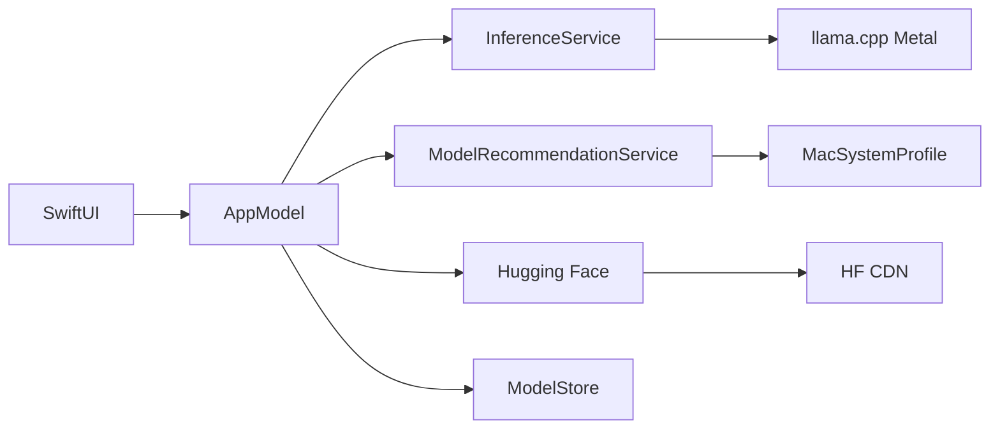

# MacLLM

<p align="center">
  <strong>Apple Silicon Mac’ler için yerel LLM sohbet uygulaması</strong><br>
  Metal hızlandırma · Hugging Face indirme · LM Studio tarzı arayüz
</p>

<p align="center">
  <a href="README.md">English</a> ·
  <a href="README.tr.md">Türkçe</a>
</p>

<p align="center">
  <a href="https://github.com/kuarezma/MacLLM/releases/latest">
    
  </a>
</p>

<p align="center">
  
</p>

---

MacLLM, [llama.cpp](https://github.com/ggml-org/llama.cpp) ve **Metal GPU** ile büyük dil modellerini **tamamen Mac’inizde** çalıştıran **native macOS** uygulamasıdır (Swift + SwiftUI). **Hugging Face** üzerinden **GGUF** modelleri indirin, akışlı sohbet edin; verileriniz cihazınızda kalır.

**Apple Silicon** (M1/M2/M3/M4) için tasarlanmıştır. Uygulama **çip ve fiziksel RAM** bilginizi okuyarak model önerilerini, varsayılan bağlam uzunluğunu ve çıkarım ayarlarını donanımınıza göre ayarlar — sabit bir “M3 16 GB” profiline bağlı değildir.

## Özellikler

| Özellik | Açıklama |
|--------|----------|
| **Native arayüz** | SwiftUI — model listesi, akışlı sohbet, ayarlar, sohbet geçmişi |
| **Metal çıkarım** | llama.cpp GPU offload; RAM’e göre varsayılanlar (8 GB’da kısmi katman) |
| **Donanıma göre katalog** | GGUF listesi: *En uygun* / *Çalışabilir* / *Uygun değil* grupları |
| **HF çevrimiçi** | Model arama, detaylı repo kartları (etiket, beğeni, Mac uyumu), quant grupları |
| **Paralel indirme** | Büyük GGUF dosyalarında **8’e kadar HTTP bağlantısı** (Ayarlar → Hugging Face); doğrudan CDN |
| **Aktif indirmeler paneli** | Tüm indirmeler: hız, kalan süre, duraklat/iptal — katalog kapalıyken de görünür |
| **Gelişmiş indirme** | % ilerleme, boyut, **MB/s**, kalan süre, **durdur**, **devam**, **iptal** |
| **Uygulama içi güncelleme** | GitHub release kontrolü, DMG/PKG/ZIP indirme |
| **GGUF doğrulama** | İndirme sonrası bütünlük kontrolü; gated/bozuk dosya için net hata |
| **Manuel kurulum** | `repo-id` + dosya adı veya yerel `.gguf` içe aktarma |
| **Uyarlanan varsayılanlar** | İlk açılışta RAM’e göre bağlam ve token limiti |
| **Ollama tarzı ayarlar** | Tam ayarlar penceresi (⌘,) — örnekleme, bağlam, sistem, stop |
| **Gizlilik** | Veriler `~/Library/Application Support/MacLLM/` altında |
| **Kolay dağıtım** | Release: **DMG**, **PKG**, **ZIP**, **Homebrew cask** |

## Gereksinimler

| | |
|--|--|
| **İşletim sistemi** | macOS 14+ (Sonoma ve üzeri) |
| **İşlemci** | Apple Silicon (`arm64`) — Intel Mac **desteklenmez** |
| **Disk** | Uygulama ~4 MB; model başına **~1–5 GB** |
| **Derleme için** | Xcode CLT, CMake 3.28+, Ninja (`brew install cmake ninja`) |

## İndir ve kur

**Son sürüm:** [github.com/kuarezma/MacLLM/releases/latest](https://github.com/kuarezma/MacLLM/releases/latest)

Her sürümde `SHA256SUMS.txt` dosyası bulunur.

| Paket | Kimler için | Adımlar |
|-------|-------------|---------|
| **`.dmg`** | Çoğu kullanıcı | DMG aç → **MacLLM**’i **Uygulamalar**’a sürükle |
| **`.pkg`** | Kurulum sihirbazı | Çift tıkla → adımları izle |
| **`.zip`** | Elle kopya | Aç → **MacLLM.app** → Uygulamalar |
| **Homebrew** | `brew` kullananlar | Aşağıya bakın |

**İlk açılış** (imzasız build): **sağ tık → Aç** veya **Sistem Ayarları → Gizlilik ve Güvenlik**.

> Modeller uygulamayla **gelmez** (~4 MB). Kurulumdan sonra uygulama içinden indirilir.

### Homebrew

```bash
brew install --cask https://raw.githubusercontent.com/kuarezma/MacLLM/main/packaging/homebrew/macllm.rb
```

Yerel cask: [packaging/homebrew/README.md](packaging/homebrew/README.md)

## Hızlı başlangıç

1. MacLLM’i kurun (DMG, PKG, zip veya Homebrew).
2. Uygulamayı açın → araç çubuğu **Çevrimiçi Model** (bulut).
3. **Önerilen** sekmesi — Mac’inize uygun model → **Çevrimiçi indir**.
4. İndirmeyi izleyin (üst panelde hız/kalan süre; Ayarlar’dan paralel bağlantı sayısı).
5. Sol panelden modeli seçin → sohbet edin.

### Model Ekle penceresi

| Sekme | İşlev |
|-------|--------|
| **Önerilen** | Donanıma göre puanlanmış katalog (Llama 3.2 1B/3B, Qwen 2.5 1.5B, Phi-3 Mini, Mistral 7B, Llama 3.1 8B, …) |
| **Çevrimiçi** | Hugging Face arama — model kartları, quant grupları, Mac rozeti, repo detayı |
| **Manuel** | Yerel `.gguf` veya `repo-id` + dosya adı |

### Model önerileri (otomatik)

Örnek: **Apple M2 · 8 GB RAM** algılanır; modeller gruplanır:

- **En uygun** — rahat çalışması beklenen  
- **Çalışabilir** — diğer uygulamaları kapatınca mümkün  
- **Genelde uygun değil** — RAM için genelde ağır  

| RAM | Uygun aralık | Genelde ağır |
|-----|--------------|--------------|
| 8 GB | 1B–3B | 7B–8B |
| 16 GB | 3B–7B | 8B üst sınır |
| 24 GB+ | 7B–8B+ | — |

İlk açılışta **bağlam uzunluğu** ve **maks. token** da RAM’e göre ayarlanır (ör. 8 GB → 2048 bağlam).

### İndirme ekranı

Model indirilirken:

- Yüzde ve ilerleme çubuğu  
- **İndirilen / toplam** boyut  
- **Hız** (MB/s veya KB/s)  
- **Tahmini kalan süre**  
- **Durdur** · **Devam** · **İptal**

### Ayarlar (Ollama uyumlu)

**MacLLM → Ayarlar…** (⌘,), araç çubuğu **dişli** veya sol panel **Ayarlar**.

| Sekme | Ollama parametresi | İçerik |
|-------|-------------------|--------|
| **Genel** | — | Sürüm, Mac bilgisi, model/sohbet klasörü, Finder’da aç |
| **Model** | `num_ctx`, `num_gpu`, `num_thread` | Bağlam 2K–32K, GPU katmanları (-1 = tümü), CPU |
| **Örnekleme** | `temperature`, `top_p`, `top_k`, `min_p`, `repeat_penalty`, `mirostat`, `seed` | llama.cpp örnekleme zinciri |
| **Sohbet** | `num_predict`, `system`, `stop` | Maks. token, sistem mesajı, stop dizileri |
| **Hugging Face** | — | Gated modeller için token |

**Ollama varsayılanları** düğmesi tipik değerlere döner. **Kaydet** ayarları saklar; bağlam/GPU değişince modeli yeniden yükler.

## Kaynaktan derleme

### 1. Klon ve alt modül

```bash
git clone --recurse-submodules https://github.com/kuarezma/MacLLM.git
cd MacLLM
```

```bash
git submodule update --init --recursive
```

### 2. llama.cpp (Metal XCFramework)

İlk sefer ~**1–5 dakika**:

```bash
./Scripts/build-llama-xcframework.sh
```

Çıktı: `Vendor/build-apple/llama.xcframework`

### 3. Uygulamayı derle

```bash
./Scripts/build-app.sh
open build/MacLLM.app
```

**Xcode:** `open MacLLM.xcodeproj` → **MacLLM** → Çalıştır (⌘R)

### 4. Release paketleri (geliştiriciler)

```bash
./Scripts/build-packages.sh          # zip + dmg + pkg + Homebrew cask güncelle
./Scripts/create-release.sh 1.4.0    # derle + GitHub release (gh gerekir)
SKIP_GITHUB=1 ./Scripts/create-release.sh 1.4.0   # yalnızca dist/ altında artefaktlar
```

`v*` etiketi push edilince [.github/workflows/release.yml](.github/workflows/release.yml) CI release oluşturur.

## Proje yapısı

```
MacLLM/
├── MacLLM/
│   ├── App/                    # MacLLMApp, AppModel
│   ├── Bridge/                 # llama.cpp köprüsü
│   ├── Core/                   # Modeller, ayar tipleri
│   ├── Features/
│   │   ├── Chat/               # Akışlı sohbet
│   │   ├── Main/               # Ana kabuk
│   │   ├── Models/             # Katalog, arama, indirme UI
│   │   └── Settings/           # Ollama tarzı ayarlar penceresi
│   ├── Services/
│   │   ├── HuggingFaceDownloadService.swift
│   │   ├── ModelRecommendationService.swift
│   │   ├── MacSystemProfile.swift
│   │   └── …
│   └── Resources/
│       └── default-catalog.json
├── packaging/homebrew/         # macllm.rb cask
├── Scripts/
│   ├── build-llama-xcframework.sh
│   ├── build-app.sh
│   ├── build-packages.sh
│   └── create-release.sh
├── Vendor/llama.cpp/
└── MacLLM.xcodeproj
```

## Veri konumları

| Öğe | Yol |
|-----|-----|
| Modeller | `~/Library/Application Support/MacLLM/models/` |
| Sohbet geçmişi | `~/Library/Application Support/MacLLM/chats/` |
| Ayarlar | UserDefaults (`inferenceSettings`, HF token) |

Eski **MacSistem** klasörü ilk açılışta **MacLLM**’e taşınır.

## Mimari



## Sürüm notları (son güncellemeler)

| Sürüm | Öne çıkanlar |
|-------|----------------|
| **1.4.3** | ChatML stop dizileri (`im_end`, `im_start`) — yanıtta kontrol token sızıntısı giderildi |
| **1.4.2** | Mistral v0.3 sohbet düzeltmesi: GGUF Jinja → `mistral-v3` (Llama-2 yanlış eşlemesi giderildi) |
| **1.4.1** | Mistral instruct sohbet şablonu düzeltmesi (`mistral-v3`), modele özel stop dizileri, yüklü modellerde şablon onarımı |
| **1.4.0** | Paralel HF indirme, aktif indirmeler paneli, zengin çevrimiçi katalog, GGUF doğrulama, RAM’e göre GPU, akış performansı |
| **1.3.2** | Uygulama içi GitHub güncellemeleri; Settings Swift 6 CI düzeltmesi |
| **1.3.0** | Ayarlar penceresi (⌘,) — Ollama uyumlu parametreler (top_k, repeat_penalty, mirostat, system, stop) |
| **1.2.2** | Dokümantasyon güncellemesi; DMG, PKG, ZIP, Homebrew paketleri |
| **1.2.1** | PKG kurulum paketi, Homebrew cask, `build-packages.sh` |
| **1.2.0** | İndirme hızı/ETA, duraklat/devam/iptal, DMG dağıtımı |
| **1.1.0** | Donanıma göre model önerileri, genişletilmiş katalog (1B–8B) |
| **1.0.0** | İlk sürüm — Metal sohbet, HF indirme, SwiftUI |

Tüm sürümler: [Releases](https://github.com/kuarezma/MacLLM/releases)

## Sorun giderme

| Sorun | Çözüm |
|-------|--------|
| Uygulama açılmıyor | Sağ tık → **Aç**; Gizlilik ve Güvenlik |
| `llama.xcframework` yok | `./Scripts/build-llama-xcframework.sh` |
| Bellek yetersiz | Küçük model (1B/3B); bağlamı düşürün; uygulamaları kapatın |
| Yavaş indirme | Ayarlar → Hugging Face → **Paralel bağlantı** (6–8 deneyin); VPN/güvenlik duvarı |
| Yavaş yanıt | Ayarlarda bağlamı düşürün; 8 GB Mac’lerde GPU katmanları otomatik sınırlı |
| İndirme hatası | Disk alanı; ağ; gated modeller için HF token; doğrulama hatasından sonra tekrar deneyin |
| İndirme takıldı | **İptal** ve tekrar deneyin; VPN/güvenlik duvarı |
| `no such module 'llama'` | XCFramework’ü yeniden derleyin |
| Homebrew SHA uyuşmazlığı | [Son release](https://github.com/kuarezma/MacLLM/releases/latest) DMG’si ile cask eşleşmeli |

## Katkı

Issue ve pull request’ler memnuniyetle karşılanır. `.gguf` model dosyalarını repoya **eklemeyin**.

## Lisans

Uygulama kaynağı olduğu gibi sunulur. [llama.cpp](https://github.com/ggml-org/llama.cpp) ve indirilen modeller kendi lisanslarına tabidir.

---

<p align="center">
  Mac için yapıldı · <a href="README.md">English README</a>
</p>
