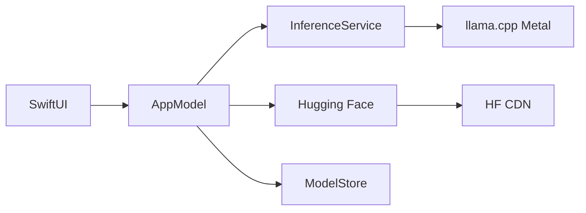

# MacLLM

<p align="center">
  <strong>Apple Silicon Mac’ler için yerel LLM sohbet uygulaması</strong><br>
  Metal hızlandırma · Hugging Face indirme · LM Studio tarzı arayüz
</p>

<p align="center">
  <a href="README.md">English</a> ·
  <a href="README.tr.md">Türkçe</a>
</p>

<p align="center">
  <a href="https://github.com/kuarezma/MacLLM/releases/latest">
    
  </a>
</p>

<p align="center">
  
</p>

---

MacLLM, [llama.cpp](https://github.com/ggml-org/llama.cpp) ve **Metal GPU** ile büyük dil modellerini **tamamen Mac’inizde** çalıştıran **native macOS** uygulamasıdır (Swift + SwiftUI). **Hugging Face** üzerinden **GGUF** modelleri indirin, akışlı (streaming) sohbet edin; verileriniz cihazınızda kalır.

**Apple Silicon** (M1/M2/M3/M4) ve **16 GB RAM** için optimize edilmiş önerilen model listesi ve çevrimiçi arama içerir.

## Özellikler

| Özellik | Açıklama |
|--------|----------|
| **Native arayüz** | SwiftUI — model listesi, akışlı sohbet, ayarlar |
| **Metal çıkarım** | llama.cpp ile Apple Silicon’da GPU offload |
| **Çevrimiçi indirme** | HF kataloğu, arama, manuel repo/dosya |
| **GGUF uyumu** | Ollama / LM Studio ile aynı format |
| **Gizlilik** | Modeller ve sohbetler `~/Library/Application Support/MacLLM/` altında |
| **İçe aktarma** | Yerel `.gguf` dosyası sürükle-bırak |

## Gereksinimler

- **macOS 14+** (Sonoma ve üzeri)
- **Apple Silicon** (`arm64`) — Intel Mac desteklenmez
- **Xcode Command Line Tools**
- **CMake 3.28+** ve **Ninja** (`brew install cmake ninja`)
- Model başına **~5–10 GB** boş disk (quantize’e göre değişir)

### Önerilen modeller (ör. M3 MacBook Air 16 GB)

| Model | Boyut (Q4) | Not |
|-------|------------|-----|
| Llama 3.2 3B Instruct | ~2 GB | Günlük kullanım için ideal |
| Phi-3 Mini 4K | ~2.3 GB | Hızlı ve verimli |
| Mistral 7B Instruct | ~4.5 GB | Daha güçlü, 16 GB’a uygun |
| Llama 3.1 8B Instruct | ~5 GB | Üst sınır — diğer uygulamaları kapatın |

## İndir (hazır uygulama)

**Son sürüm:** [github.com/kuarezma/MacLLM/releases/latest](https://github.com/kuarezma/MacLLM/releases/latest)

1. `MacLLM-1.0.0-macOS-arm64.zip` dosyasını indirin (yalnızca Apple Silicon)
2. Açın ve **MacLLM.app** dosyasını Uygulamalar’a taşıyın
3. İlk açılış: **sağ tık → Aç** (uygulama henüz notarize edilmedi)
4. **Çevrimiçi Model** ile Hugging Face’ten GGUF indirin, sohbet edin

> Modeller indirmede **yoktur** (~4 MB uygulama). Modelleri uygulama içinden indirirsiniz.

## Kaynaktan derleme

### 1. Klonlayın ve alt modülü alın

```bash
git clone --recurse-submodules https://github.com/kuarezma/MacLLM.git
cd MacLLM
```

Alt modül alınmadıysa:

```bash
git submodule update --init --recursive
```

### 2. llama.cpp derleyin (Metal XCFramework)

İlk sefer **~1–5 dakika** sürebilir:

```bash
./Scripts/build-llama-xcframework.sh
```

Çıktı: `Vendor/build-apple/llama.xcframework`

### 3. Uygulamayı derleyin ve çalıştırın

```bash
./Scripts/build-app.sh
open build/MacLLM.app
```

**Xcode ile:**

```bash
open MacLLM.xcodeproj
# Scheme: MacLLM → Çalıştır (⌘R)
```

### 4. Model indirin ve sohbet edin

1. Araç çubuğunda **Çevrimiçi Model** (bulut simgesi)  
2. **Çevrimiçi** sekmesi → arama veya önerilen model → **İndir**  
3. Sol panelden modeli seçin → mesaj yazın  

İsteğe bağlı: **MacLLM → Settings** — sıcaklık, bağlam, GPU katmanları, Hugging Face token (gated modeller).

## Proje yapısı

```
MacLLM/
├── MacLLM/                 # SwiftUI kaynak kodu
│   ├── App/
│   ├── Bridge/             # llama.cpp köprüsü
│   ├── Features/           # Sohbet, model, ayarlar
│   ├── Services/           # İndirme, çıkarım, depolama
│   └── Resources/
├── Scripts/
│   ├── build-llama-xcframework.sh
│   ├── build-app.sh
│   └── fit-app-icon.py
├── Vendor/llama.cpp/       # git alt modülü
└── MacLLM.xcodeproj
```

## Veri konumları

| Öğe | Yol |
|-----|-----|
| Modeller | `~/Library/Application Support/MacLLM/models/` |
| Sohbet geçmişi | `~/Library/Application Support/MacLLM/chats/` |
| Ayarlar | UserDefaults |

Eski **MacSistem** klasörü ilk açılışta otomatik **MacLLM**’e taşınır.

## Mimari



## Sorun giderme

| Sorun | Çözüm |
|-------|--------|
| `llama.xcframework` yok | `./Scripts/build-llama-xcframework.sh` |
| Bellek yetersiz | Daha küçük Q4 model; bağlamı 4096 yapın |
| Yavaş yanıt | Ayarlar → GPU katmanları = **-1** |
| İndirme hatası | Ağ/disk; gated modeller için HF token |
| `no such module 'llama'` | XCFramework’ü yeniden derleyin |

## Katkı

Issue ve pull request’ler memnuniyetle karşılanır. Büyük `.gguf` model dosyalarını repoya eklemeyin.

## Lisans

Uygulama kaynağı olduğu gibi sunulur. [llama.cpp](https://github.com/ggml-org/llama.cpp) ve indirilen modeller kendi lisanslarına tabidir.

---

<p align="center">
  Mac için yapıldı · <a href="README.md">English README</a>
</p>
